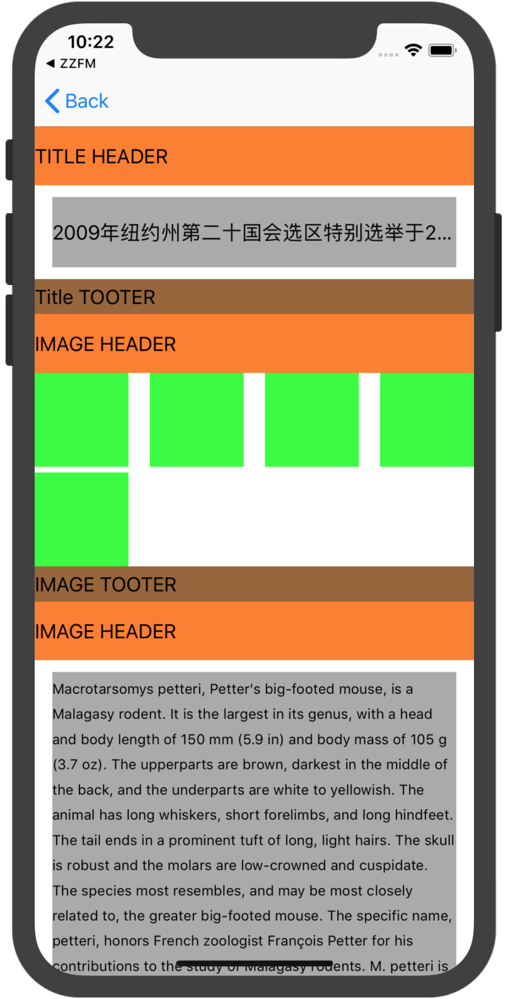

# DDComponentsKit

[](https://travis-ci.org/540563689@qq.com/DDComponentsKit)
[](https://cocoapods.org/pods/DDComponentsKit)
[](https://cocoapods.org/pods/DDComponentsKit)
[](https://cocoapods.org/pods/DDComponentsKit)

## Example

To run the example project, clone the repo, and run `pod install` from the Example directory first.

**可以通过该组件来创建模块比较多比较复杂的UICollectionView 或者tableView布局**
本组件的实现代码采用的是 [djs66256/DDComponent作者](https://github.com/djs66256/DDComponent)的DDComponent [源地址链接](https://github.com/djs66256/DDComponent) 

原作者苍耳 关于组件对用的文章 [【美学的表现层组件化之路】](https://djs66256.github.io/2017/04/09/2017-04-09-美学的表现层组件化之路/)

## Requirements

第一步： 创建Root组件

	@property (nonatomic, strong) DDCollectionViewRootComponent *rootComponent;
	
	// 懒加载
	- (DDCollectionViewRootComponent *)rootComponent {
    if (_rootComponent == nil) {
        _rootComponent = [[DDCollectionViewRootComponent alloc] initWithCollectionView:self.collectionView bind:YES];
    }
    return _rootComponent;
}	


第二步： 创建自定义的模块组件 例如

```
	// 标题组件
    TGTitlesComponent *titlesComponent = [[TGTitlesComponent alloc] init];
    titlesComponent.headerComponent = self.titleHeaderComponent;
    titlesComponent.footerComponent = self.titleFooterComponent;
    titlesComponent.cellModels = self.titleModels;
    
    // 文本组件
    TGTextComponent *textComponent = [[TGTextComponent alloc] init];
    textComponent.headerComponent = self.headerComponent;
    textComponent.footerComponent = self.footerComponent;
    textComponent.cellModels  = self.textModels;
    
    // 图片组件
    TGImagesComponent *imagesComponent = [[TGImagesComponent alloc] init];
    imagesComponent.headerComponent = self.headerComponent;
    imagesComponent.footerComponent = self.footerComponent;
    imagesComponent.images = self.imageModels;
    
```

第三步： 将自定义组件数组赋值给root组件, 刷新控件

 	self.rootComponent.subComponents = @[titlesComponent, imagesComponent, textComponent];
    [self.collectionView reloadData];


**更详细的用法请看DDComponentsKit组件代码的demo**




## Installation

DDComponentsKit is available through [CocoaPods](https://cocoapods.org). To install
it, simply add the following line to your Podfile:

```ruby
pod 'DDComponentsKit'
```

## Author

540563689@qq.com, zhengjia@donews.com

## License

DDComponentsKit is available under the MIT license. See the LICENSE file for more info.
